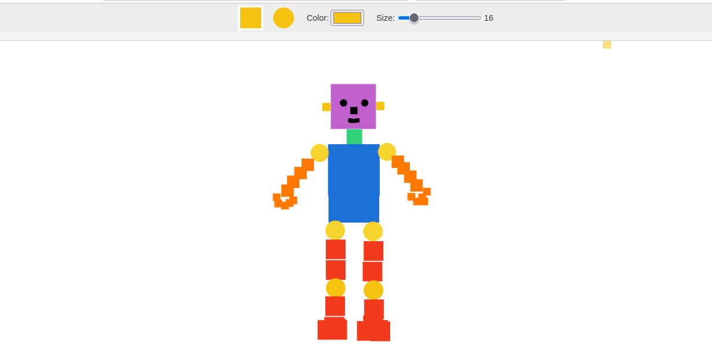
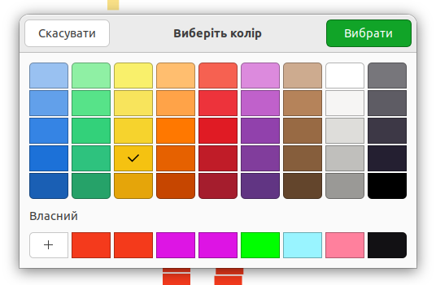
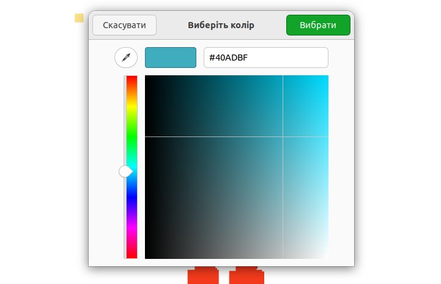

<h1 align="center">First canva project</h1>

## Description

This is a simple graphic editor for drawing. It allows you to draw circles and squares. You can choose the size of the shapes and their color - either from a predefined palette or custom.

## Tools

- HTML5,
- CSS3,
- TypeScript
